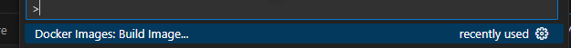

This is a [Next.js](https://nextjs.org) project bootstrapped with [`create-next-app`](https://nextjs.org/docs/app/api-reference/cli/create-next-app).

## Getting Started

First, run the development server:

```bash
npm run dev
# or
yarn dev
# or
pnpm dev
# or
bun dev
```

Open [http://localhost:3000](http://localhost:3000) with your browser to see the result.

You can start editing the page by modifying `app/page.tsx`. The page auto-updates as you edit the file.

This project uses [`next/font`](https://nextjs.org/docs/app/building-your-application/optimizing/fonts) to automatically optimize and load [Geist](https://vercel.com/font), a new font family for Vercel.

## Learn More

To learn more about Next.js, take a look at the following resources:

- [Next.js Documentation](https://nextjs.org/docs) - learn about Next.js features and API.
- [Learn Next.js](https://nextjs.org/learn) - an interactive Next.js tutorial.

You can check out [the Next.js GitHub repository](https://github.com/vercel/next.js) - your feedback and contributions are welcome!

## Deploy on Vercel

The easiest way to deploy your Next.js app is to use the [Vercel Platform](https://vercel.com/new?utm_medium=default-template&filter=next.js&utm_source=create-next-app&utm_campaign=create-next-app-readme) from the creators of Next.js.

Check out our [Next.js deployment documentation](https://nextjs.org/docs/app/building-your-application/deploying) for more details.


## Manual deploy to azure container registry and web app

Use the correct part of the Dockerfile

# Manual deploy:

    FROM mcr.microsoft.com/appsvc/dotnetcore:lts

    ENV PORT 8080
    EXPOSE 8080
    
    ENV ASPNETCORE_URLS "http://*:${PORT}"
    
    ENTRYPOINT ["dotnet", "/defaulthome/hostingstart/hostingstart.dll"]
In the top:



>Docker Images: Build Image...

Name the image akdstaticwebapp.azurecr.io/akdstaticwebapp:latest

Then after building, click the Docker logo in the menu

Click on the image you created and then select push

Check in the Registries tab in the Docker tab that the lasest image is in your registry

Right click the image and choose "Deploy image to azure app service..."

Choose a globally unique name of the app, the one you already have? Why do I have to create a new one all the time?


## Run locally

docker build -t akdstaticwebapps .  

docker run -p 3000:3000 akdstaticwebapps

